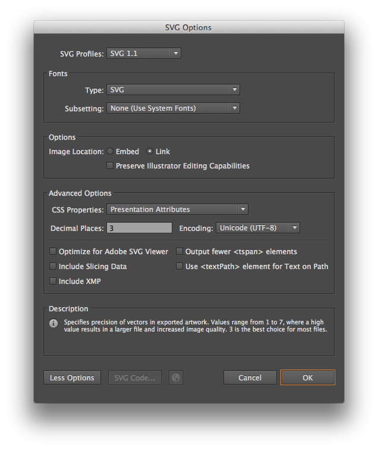

**Plugin for Brackets:**
* ***Brackets Color Picker*** - Mikail COLAK
* ***Brackets SASS Code Hints*** - Amin Ullah Khan
* ***Color Highlighter*** - Alexander Taratin
* ***Emmet*** - Sergey Chikuyonok
* ***Indentator*** - Andrew Huth
* ***Introversed Dark*** - mhismail3
* ***Quick Search*** - Nathan Turner
* ***Show Whitespace VS*** - Pat Lillis

**Resource list:**
- https://webref.ru/
- https://fonts.google.com/
- http://bootstrap-3.ru/index.php
- http://getbootstrap.com/
- http://www.font2web.com/ //Fonts Converter
- https://fontawesome.ru/ //Icons
- http://cubic-bezier.com //CSS3 Animation
- http://csssprites.com //img sprites
- http://dnzl.ru/view_post.php?id=320 //owl-carousel
- https://www.kunkalabs.com/mixitup/ // MixItUp 3 jQuery layout
- https://sass-scss.ru/ //Sass
- https://icomoon.io/ - //Font & SVG
- https://realfavicongenerator.net/ //Favicon generator
- https://www.cssmatic.com/box-shadow //Shadow generator

**Git Resource:**
* slick-carousel
* magnific-popup
* mixitup




**placeholder:**
```css
*::-webkit-input-placeholder {
    color: #b2b2b2;
    opacity: 1;
}

*:-moz-placeholder {
    color: #b2b2b2;
    opacity: 1;
}

*::-moz-placeholder {
    color: #b2b2b2;
    opacity: 1;
}

*:-ms-input-placeholder {
    color: #b2b2b2;
    opacity: 1;
}
```